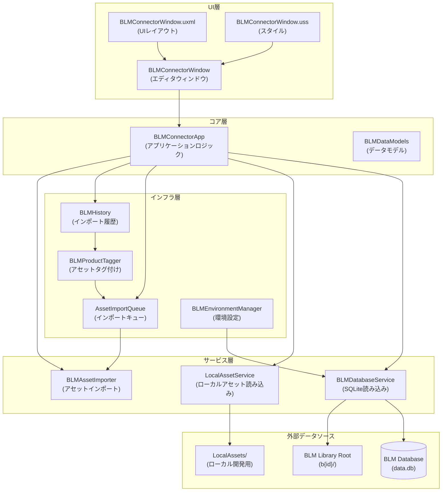
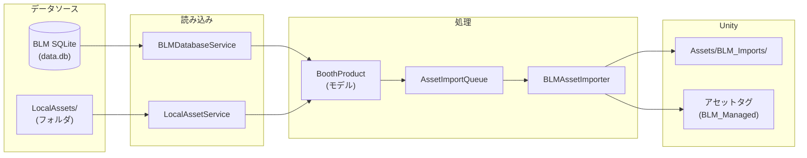
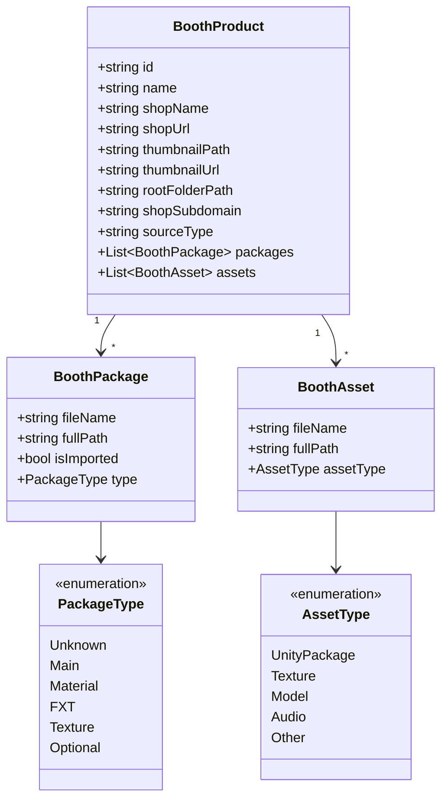

# Morulab Unity Tools

Morulab製Unityツール集。ランチャーシステム + BLM Local Connector（BOOTH Library Manager連携ツール）を含みます。

## VCCへの追加

以下のURLをVCCの「Add Repository」に追加してください：

```
https://moruton1119.github.io/com.morulab.unity-tools/index.json
```

## 主な機能

- **Morulab Launcher**: ツール統合管理ランチャー（多言語対応: EN/JA/KO）
- **BLMデータベース連携**: BLMのSQLiteデータベースから商品情報を読み込み
- **ローカルアセット対応**: `LocalAssets/`フォルダで自作アセットも管理
- **一括インポート**: キューシステムによる複数アセットの一括インポート
- **インポート履歴管理**: タグベースでインストール済みアセットを追跡

---

## アーキテクチャ

### システム全体図



### データフロー



---

## コンポーネント詳細

| ファイル | 役割 |
|---------|------|
| `BLMConnectorWindow.cs` | Unity エディタウィンドウのエントリーポイント |
| `BLMConnectorApp.cs` | UIイベント処理、フィルタリング、グリッド表示ロジック |
| `BLMDatabaseService.cs` | BLMのSQLiteデータベースから商品情報を読み込み |
| `LocalAssetService.cs` | `LocalAssets/`フォルダから自作アセットをスキャン |
| `BLMDataModels.cs` | データモデル定義 (`BoothProduct`, `BoothAsset`, `BoothPackage`) |
| `BLMAssetImporter.cs` | アセットをUnityにインポート（コピー/パッケージインポート） |
| `AssetImportQueue.cs` | インポートキュー管理（中断・再開・永続化対応） |
| `BLMHistory.cs` | インストール済み商品をアセットタグで追跡 |
| `BLMProductTagger.cs` | インポート時に自動で`BLM_PID_xxx`タグを付与 |
| `BLMEnvironmentManager.cs` | SQLite DLL の競合検出・解決・環境設定 |

---

## データモデル



---

## 使用方法

### 1. ランチャーを開く

Unityメニューから `Morulab > Launcher` を選択。

### 2. BLM Connector を使用

ランチャーから `BLM Connector` を選択するか、`Morulab > BLM Connector (Standalone)` から直接開く。

### 3. アセットのインポート

1. **グリッドから選択**: 商品をクリックして詳細を表示
2. **ダブルクリック**: 全パッケージをキューに追加
3. **個別インポート**: 詳細パネルから特定のアセットのみインポート
4. **キュー処理**: `Process Queue` ボタンで一括インポート実行

### 4. ローカルアセットの追加

1. `Open Local Assets Folder` でフォルダを開く
2. `LocalAssets/` 内にフォルダを作成
3. `.unitypackage` ファイルを配置
4. Refresh で読み込み

### 5. インポート先

| アセットタイプ | インポート先 |
|--------------|------------|
| UnityPackage | 標準インポートダイアログ |
| その他 (画像/モデル/音声) | `Assets/BLM_Imports/{商品名}/` |

---

## 依存関係

- **SQLite**: `sqlite3.dll`, `Mono.Data.Sqlite.dll`
- **Unity Editor**: UI Toolkit (UXML/USS)
